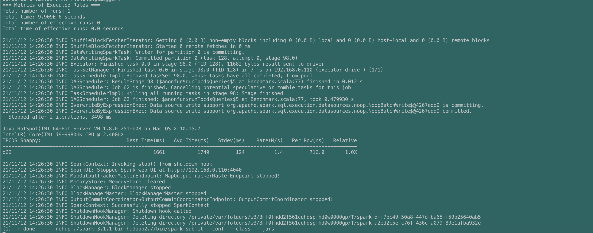
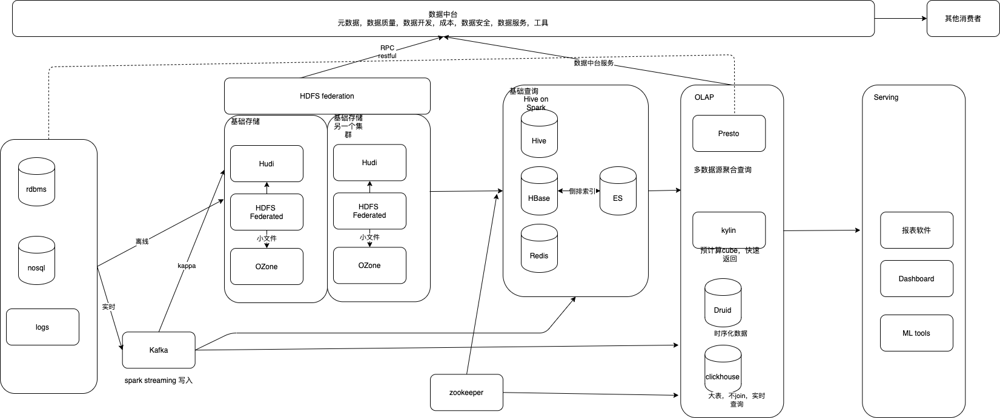

用到的rule
=== Applying Rule org.apache.spark.sql.catalyst.analysis.Analyzer$ResolveAggregateFunctions ===
=== Applying Rule org.apache.spark.sql.catalyst.analysis.Analyzer$ResolveFunctions ===
=== Applying Rule org.apache.spark.sql.catalyst.analysis.Analyzer$ResolveReferences ===
=== Applying Rule org.apache.spark.sql.catalyst.analysis.Analyzer$ResolveRelations ===
=== Applying Rule org.apache.spark.sql.catalyst.analysis.CleanupAliases ===
=== Applying Rule org.apache.spark.sql.catalyst.analysis.DecimalPrecision ===
=== Applying Rule org.apache.spark.sql.catalyst.analysis.EliminateSubqueryAliases ===
=== Applying Rule org.apache.spark.sql.catalyst.analysis.ResolveTimeZone ===
=== Applying Rule org.apache.spark.sql.catalyst.analysis.TypeCoercion$CaseWhenCoercion ===
=== Applying Rule org.apache.spark.sql.catalyst.optimizer.CollapseProject ===
=== Applying Rule org.apache.spark.sql.catalyst.optimizer.ColumnPruning ===
=== Applying Rule org.apache.spark.sql.catalyst.optimizer.ConstantFolding ===
=== Applying Rule org.apache.spark.sql.catalyst.optimizer.InferFiltersFromConstraints ===
=== Applying Rule org.apache.spark.sql.catalyst.optimizer.PushDownPredicates ===
=== Applying Rule org.apache.spark.sql.catalyst.optimizer.RemoveNoopOperators ===
=== Applying Rule org.apache.spark.sql.catalyst.optimizer.RemoveRedundantAliases ===
=== Applying Rule org.apache.spark.sql.catalyst.optimizer.ReorderJoin ===
=== Applying Rule org.apache.spark.sql.catalyst.optimizer.RewritePredicateSubquery ===
=== Applying Rule org.apache.spark.sql.catalyst.optimizer.SimplifyCasts ===
=== Applying Rule org.apache.spark.sql.execution.ApplyColumnarRulesAndInsertTransitions ===
=== Applying Rule org.apache.spark.sql.execution.CollapseCodegenStages ===
=== Applying Rule org.apache.spark.sql.execution.RemoveRedundantProjects ===
=== Applying Rule org.apache.spark.sql.execution.exchange.EnsureRequirements ===
=== Applying Rule org.apache.spark.sql.execution.exchange.ReuseExchange ===

--首先来看看SimplifyCasts
/**
 * Removes [[Cast Casts]] that are unnecessary because the input is already the correct type.
 */
object SimplifyCasts extends Rule[LogicalPlan] {
  def apply(plan: LogicalPlan): LogicalPlan = plan.transformAllExpressionsWithPruning(
    _.containsPattern(CAST), ruleId) {
    case Cast(e, dataType, _, _) if e.dataType == dataType => e
    case c @ Cast(e, dataType, _, _) => (e.dataType, dataType) match {
      case (ArrayType(from, false), ArrayType(to, true)) if from == to => e
      case (MapType(fromKey, fromValue, false), MapType(toKey, toValue, true))
        if fromKey == toKey && fromValue == toValue => e
      case _ => c
      }
  }
}

从注释可以看出，这个rule是为了去掉不必须的cast，仔细看代码，哪些地方是非必须的。
首先进入条件是logicalPlan含有"CAST"
a.case Cast(e, dataType, _, _) if e.dataType == dataType => e, 意思是cast前后的类型一致就跳过，case Cast(e, dataType, _, _) if e.dataType == dataType => e
b.case (ArrayType(from, false), ArrayType(to, true)) if from == to => e，意思是都是ArrayType，cast前不包含null，cast之后包括null的也跳过
c.case (MapType(fromKey, fromValue, false), MapType(toKey, toValue, true)) ,意思是都是Maptype并且key，value的type相同，cast之前不包含null，cast之后包括null的也跳过
仔细看一下q66，本身sql是不包括Cast，那么Cast是怎么出来的呢？
sum(jan_sales / w_warehouse_sq_ft)这个除法是除数和被除数的数据类型不一致导致。

再上个例子
// Case 1. The input is already the type to cast to
scala> val ds = spark.range(1)
ds: org.apache.spark.sql.Dataset[Long] = [id: bigint]

scala> ds.printSchema
root
 |-- id: long (nullable = false)

scala> ds.selectExpr("CAST (id AS long)").explain(true)
...
=== Applying Rule org.apache.spark.sql.catalyst.optimizer.SimplifyCasts ===
!Project [cast(id#2L as bigint) AS id#4L]   Project [id#2L AS id#4L]
 +- Range (0, 1, step=1, splits=Some(16))   +- Range (0, 1, step=1, splits=Some(16)
...

--其次再看看ConstantFolding
/**
 * Replaces [[Expression Expressions]] that can be statically evaluated with
 * equivalent [[Literal]] values.
 */
object ConstantFolding extends Rule[LogicalPlan] {

  private def hasNoSideEffect(e: Expression): Boolean = e match {
    case _: Attribute => true
    case _: Literal => true
    case _: NoThrow if e.deterministic => e.children.forall(hasNoSideEffect)
    case _ => false
  }

  def apply(plan: LogicalPlan): LogicalPlan = plan.transformWithPruning(AlwaysProcess.fn, ruleId) {
    case q: LogicalPlan => q.transformExpressionsDownWithPruning(
      AlwaysProcess.fn, ruleId) {
      // Skip redundant folding of literals. This rule is technically not necessary. Placing this
      // here avoids running the next rule for Literal values, which would create a new Literal
      // object and running eval unnecessarily.
      case l: Literal => l

      case Size(c: CreateArray, _) if c.children.forall(hasNoSideEffect) =>
        Literal(c.children.length)
      case Size(c: CreateMap, _) if c.children.forall(hasNoSideEffect) =>
        Literal(c.children.length / 2)

      // Fold expressions that are foldable.
      case e if e.foldable => Literal.create(e.eval(EmptyRow), e.dataType)
    }
  }
}
ConstantFolding is a base logical optimization that replaces expressions that can be statically evaluated with their equivalent literal values.
意思就是可以静态的eval出来的表达式，适用ConstantFolding

来个例子

scala> spark.range(1).select(lit(3) > 2).explain(true)

=== Applying Rule org.apache.spark.sql.catalyst.optimizer.ConstantFolding ===
 GlobalLimit 21                                                                GlobalLimit 21
 +- LocalLimit 21                                                              +- LocalLimit 21
!   +- Project [cast((id#94L > cast(5 as bigint)) as string) AS (id > 5)#99]      +- Project [cast((id#94L > 5) as string) AS (id > 5)#99]
       +- Range (0, 10, step=1, splits=Some(16))                                     +- Range (0, 10, step=1, splits=Some(16))

这里因为lit(3) > 2),所以就显示True。
改成lit(3)<2 就显示False

--还想看看PushDownPredicates

/**
 * The unified version for predicate pushdown of normal operators and joins.
 * This rule improves performance of predicate pushdown for cascading joins such as:
 *  Filter-Join-Join-Join. Most predicates can be pushed down in a single pass.
 */
object PushDownPredicates extends Rule[LogicalPlan] with PredicateHelper {
  def apply(plan: LogicalPlan): LogicalPlan = plan.transformWithPruning(
    _.containsAnyPattern(FILTER, JOIN)) {
    CombineFilters.applyLocally
      .orElse(PushPredicateThroughNonJoin.applyLocally)
      .orElse(PushPredicateThroughJoin.applyLocally)
  }
}

看代码入口是logical plan包括filter和join，有两类pushdown，一类是通过join，一类是不通过join

/**
 * Pushes [[Filter]] operators through many operators iff:
 * 1) the operator is deterministic
 * 2) the predicate is deterministic and the operator will not change any of rows.
 *
 * This heuristic is valid assuming the expression evaluation cost is minimal.
 */
object PushPredicateThroughNonJoin extends Rule[LogicalPlan] with PredicateHelper
注释说2种，一种是operator是确定的，另一种是predicate是确定的。

------------------------------------------------------------------------------------------------------------

HDFS 的读写流程：
写流程

1、 使用HDFS提供的客户端Client， 向远程的Namenode发起RPC请求
2、 Namenode会检查要创建的文件是否已经存在， 创建者是否有权限进行操作， 成功则会为文件创建一个记录， 否则会让客户端抛出异常；
3、 当客户端开始写入文件的时候， 客户端会将文件切分成多个packets， 并在内部以数据队列“data queue（ 数据队列） ”的形式管理这些packets， 并向Namenode申请blocks， 获取用来存储replicas的合适的datanode列表， 列表的大小根据Namenode中replication的设定而定；
4、 开始以pipeline（ 管道） 的形式将packet写入所有的replicas中。 开发库把packet以流的方式写入第一个datanode， 该datanode把该packet存储之后， 再将其传递给在此pipeline中的下一个datanode， 直到最后一个datanode， 这种写数据的方式呈流水线的形式。
5、 最后一个datanode成功存储之后会返回一个ack packet（ 确认队列） ， 在pipeline里传递至客户端， 在客户端的开发库内部维护着”ack queue”， 成功收到datanode返回的ack packet后会从”ack queue”移除相应的packet。
6、 如果传输过程中， 有某个datanode出现了故障， 那么当前的pipeline会被关闭， 出现故障的datanode会从当前的pipeline中移除， 剩余的block会继续剩下的datanode中继续以pipeline的形式传输， 同时Namenode会分配一个新的datanode， 保持replicas设定的数量。
7、 客户端完成数据的写入后， 会对数据流调用close()方法， 关闭数据流；
8、 只要写入了dfs.replication.min的复本数（ 默认为1） ， 写操作就会成功， 并且这个块可以在集群中异步复制， 直到达到其目标复本数（ dfs． replication的默认值为3） ， 因为namenode已经知道文件由哪些块组成， 所以它在返回成功前只需要等待数据块进行最小量的复制。

读流程
 1、 使用HDFS提供的客户端Client， 向远程的Namenode发起RPC请求；
 2、 Namenode会视情况返回文件的部分或者全部block列表， 对于每个block， Namenode都会返回有该block拷贝的DataNode地址；
 3、 客户端Client会选取离客户端最近的DataNode来读取block； 如果客户端本身就是DataNode， 那么将从本地直接获取数据；
 4、 读取完当前block的数据后， 关闭当前的DataNode链接， 并为读取下一个block寻找最佳的DataNode；
 5、 当读完列表block后， 且文件读取还没有结束， 客户端会继续向Namenode获取下一批的block列表；
 6、 读取完一个block都会进行checksum验证， 如果读取datanode时出现错误， 客户端会通知Namenode， 然后再从下一个拥有该block拷贝的datanode继续读。
  
------------------------------------------------------------------------------------------------------------

 
 Spark Shuffle 的工作原理
1. Hash Shuffle V1

 相对于传统的 MapReduce，Spark 假定大多数情况下 Shuffle 的数据不需要排序，例如 Word Count，强制排序反而会降低性能。因此不在 Shuffle Read 时做 Merge Sort，如果需要合并的操作的话，则会使用聚合（agggregator），即用了一个 HashMap （实际上是一个 AppendOnlyMap）来将数据进行合并。
 
 总结下这里的两个严重问题：
 
 a.生成大量文件(M*R)，占用文件描述符，同时引入 DiskObjectWriter 带来的 Writer Handler 的缓存也非常消耗内存；
 b.如果在 Reduce Task 时需要合并操作的话，会把数据放在一个 HashMap 中进行合并，如果数据量较大，很容易引发 OOM。
 
2. Hash Shuffle V2
 针对上面的第一个问题，Spark 做了改进，引入了 File Consolidation 机制。
 
 一个 Executor 上所有的 Map Task 生成的分区文件只有一份，即将所有的 Map Task 相同的分区文件合并，这样每个 Executor 上最多只生成 N 个分区文件。
 
 这样就减少了文件数，但是假如下游 Stage 的分区数 N 很大，还是会在每个 Executor 上生成 N 个文件，同样，如果一个 Executor 上有 K 个 Core，还是会开 K*N 个 Writer Handler，所以这里仍然容易导致OOM。
 
3. Sort Shuffle V1
 为了更好地解决上面的问题，Spark 参考了 MapReduce 中 Shuffle 的处理方式，引入基于排序的 Shuffle 写操作机制。
 
 每个 Task 不会为后续的每个 Task 创建单独的文件，而是将所有对结果写入同一个文件。该文件中的记录首先是按照 Partition Id 排序，每个 Partition 内部再按照 Key 进行排序，Map Task 运行期间会顺序写每个 Partition 的数据，同时生成一个索引文件记录每个 Partition 的大小和偏移量。
 
 在 Reduce 阶段，Reduce Task 拉取数据做 Combine 时不再是采用 HashMap，而是采用ExternalAppendOnlyMap，该数据结构在做 Combine 时，如果内存不足，会刷写磁盘，很大程度的保证了鲁棒性，避免大数据情况下的 OOM。
 
 总体上看来 Sort Shuffle 解决了 Hash Shuffle 的所有弊端，但是因为需要其 Shuffle 过程需要对记录进行排序，所以在性能上有所损失。
 
4. Tungsten-Sort Based Shuffle / Unsafe Shuffle
 它的做法是将数据记录用二进制的方式存储，直接在序列化的二进制数据上 Sort 而不是在 Java 对象上，这样一方面可以减少内存的使用和 GC 的开销，另一方面避免 Shuffle 过程中频繁的序列化以及反序列化。在排序过程中，它提供 cache-efficient sorter，使用一个 8 bytes 的指针，把排序转化成了一个指针数组的排序，极大的优化了排序性能。
 
 但是使用 Tungsten-Sort Based Shuffle 有几个限制，Shuffle 阶段不能有 aggregate 操作，分区数不能超过一定大小（2^24-1，这是可编码的最大 Parition Id），所以像 reduceByKey 这类有 aggregate 操作的算子是不能使用 Tungsten-Sort Based Shuffle，它会退化采用 Sort Shuffle。
 
5.  Sort Shuffle v2
从 Spark-1.6.0 开始，把 Sort Shuffle 和 Tungsten-Sort Based Shuffle 全部统一到 Sort Shuffle 中，如果检测到满足 Tungsten-Sort Based Shuffle 条件会自动采用 Tungsten-Sort Based Shuffle，否则采用 Sort Shuffle。从Spark-2.0.0开始，Spark 把 Hash Shuffle 移除，可以说目前 Spark-2.0 中只有一种 Shuffle，即为 Sort Shuffle。

------------------------------------------------------------------------------------------------------------

数据系统设计
